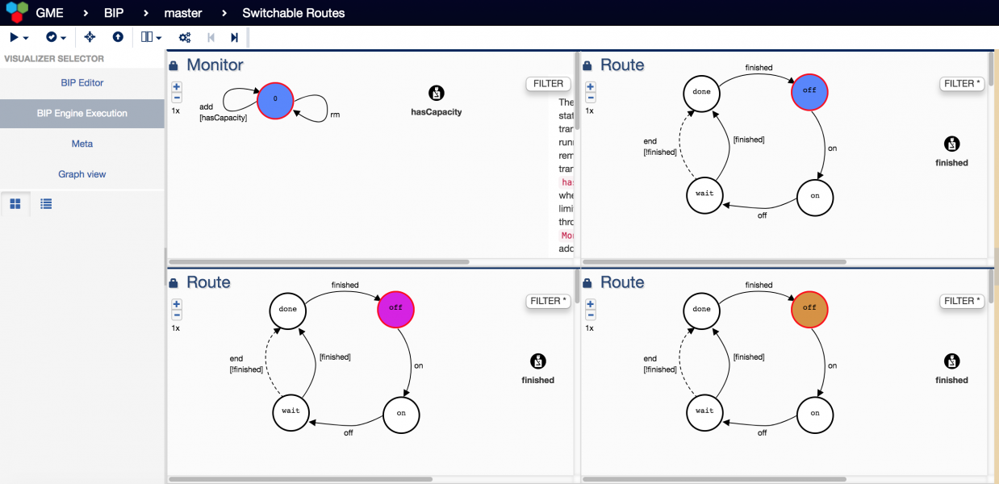

# DesignBIP 

This repository contains the implementation of DesignBIP, which a design studio for the BIP (Behavior-Interaction-Priority) component-based framework. DesignBIP is built on [WebGME](http://github.com/webgme/webgme). 

## Contents
1. [What is DesignBIP?](#what-is-designbip)
    1. [Features of the Design Studio](#features)
2. [How to install DesignBIP?](#how-to-install-designbip)
3. [What is BIP?](#what-is-bip)

## What is DesignBIP?
DesignBIP is a web-based, collaborative, modeling and execution environment for building concurrent systems using the BIP component framework. DesignBIP allows specifying BIP interaction and behavior models in a graphical way and generating the equivalent code. DesignBIP provides model repositories, design guidance services, code generators and integration with the BIP tool-set.

### Features

* Collaborative, automatically versioned web-based development.


* Dedicated BIP model editors.


* Fully integrated Java code development.


* Fully integrated code compilation, execution with the integrated BIP-engine tool and visualization.



* Model repositories for architecture styles.


* Embeddable documentation at every level of the model (shown previously).

## How to install DesignBIP?
First, install the following:
- [NodeJS](https://nodejs.org/en/download/) (v4.x.x recommended)
- [MongoDB](https://www.mongodb.com/download-center#production)

To clone the repository, first install (if necessary):
- [Git](https://git-scm.com/downloads)

and then clone the repository in your preferred directory, for example:
```
cd /home/$USER
git clone https://github.com/DesignBIP/DesignBIP.git
```
This makes the 'project root' for the git repo `/home/$USER/DesignBIP` (you can pick a different location for it besides `/home/$USER/` if you'd like).

Install packages with npm in the project root (`DesignBIP`):
```
cd /home/$USER/DesignBIP
npm install
npm install webgme
```
Start mongodb locally by running the `mongod` executable in your mongodb installation (you may need to create a `data` directory or set `--dbpath`). For example:
```
cd /home/$USER
mkdir bip_data
mongodb --dbpath ./bip_data
```
wait until you see a line that says "[initandlisten] waiting for connections on port 27017".

Then, in a new terminal window, run `npm start` from the project root (`DesignBIP`) to start. For example:
```
cd /home/$USER/DesignBIP
npm start
```
After the webgme server is up and there are no error messages in the console, open a valid address in the browser to start using the DesignBIP design studio. The default is http://127.0.0.1:8888/, you should see all valid addresses in the console.

Click `Create New…` to create a new project.
After entering a project name of your choice, import the seed `BIP` to start working on BIP!

## What is BIP?
BIP is a framework for the component-based design and analysis of software systems. It has been successfully used for modeling and analysis of a variety of case studies and applications, such as performance evaluation, modeling and analysis of TinyOS-based wireless sensor network applications, construction and verification of a robotic system. In the latter, the code generated by the tool-chain along with the BIP engine is used as a controller for the robot. The BIP framework also offers validation techniques for checking essential safety properties.

* [More information about BIP](http://www-verimag.imag.fr/Rigorous-Design-of-Component-Based.html)
* [More information about JavaBIP](http://onlinelibrary.wiley.com/doi/10.1002/spe.2495/abstract)


